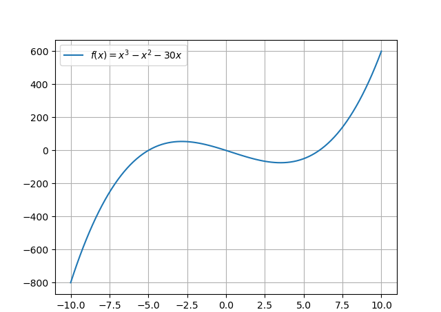

# 2021 SCUT秋季最优化计算课程一维搜索作业 

## 一、编程语言
&emsp;&emsp;算法源代码均采用[Python](https://www.python.org/)语言编程。由于采用了[f-string](https://docs.python.org/3/reference/lexical_analysis.html#f-strings)，即格式化字符串常量（formatted string literals）作为输出格式化方法，因此需要Python>=3.6。需要安装[matplotlib](https://matplotlib.org/)可视化库来绘制图像。需要安装[numpy](https://numpy.org/)数学计算库来求解线性方程组。简单修改输出格式化方法就可移植到更低版本的Python3上，但Python2不支持中文变量。

&emsp;&emsp;本文档采用[Markdown](http://www.markdown.cn/)语言编写。
## 二、函数图像及最优解表达式

图2-1 函数图像

$$
f(x)=x^3-x^2-30x)
$$
&emsp;&emsp;对$f(x)$求导可得：
$$
f'(x)=3x^2-2x-30
$$

&emsp;&emsp;令

$$
f'(x)=0
$$
&emsp;&emsp;可得：
$$
x=\frac{1\pm\sqrt{91}}{3}
$$
&emsp;&emsp;由函数值的正负性可知，其极小值点的表达式为：
$$
x=\frac{1+\sqrt{91}}{3}\approx3.51313067
$$
&emsp;&emsp;极大值点的表达式为：
$$
x=\frac{1-\sqrt{91}}{3}\approx-2.84646400
$$
## 三、外推内插法确定单谷区间

表3-1 不同起点与步长时外推内插法确定的单谷区间

&emsp;&emsp;不同起点与步长时外推内插法确定的单谷区间如表3-1所示

## 四、黄金分割法、抛物线逼近法计算极小值点
&emsp;&emsp;从表3-1中选取起点为$4$，步长为$0.1$时，得到的单谷区间为$(3.3, 4.1)$。

&emsp;&emsp;使用黄金分割法，设置精度为$1×10^{-8}$，得到极小值点为$3.51313064$。

&emsp;&emsp;使用抛物线逼近法，设置精度为$1×10^{-8}$，得到极小值点为$3.51313066$。

## 五、求极大值修改方案
&emsp;&emsp;方案一：将上述算法流程中所有大小逻辑判断的符号取反。

&emsp;&emsp;方案二：将目标函数添加一个负号取反，其余方法按照上述流程计算，最后将得到的极小值点即为原目标函数的极大值点。程序采用此方法计算，将变量`求极小`设置为逻辑非`False`即可。

&emsp;&emsp;在起点为$-2$，步长为$0.01$时，得到单谷区间为$(-3.27, -1.99)$。

&emsp;&emsp;使用黄金分割法，设置精度为$1×10^{-8}$，得到极大值点为$-2.84646399$。

&emsp;&emsp;使用抛物线逼近法，设置精度为$1×10^{-8}$，得到极大值点为$-2.84646400$。

## 六、关于本文档
&emsp;&emsp;本文档是2021年秋华南理工大学最优化计算课程一维搜索的作业。

&emsp;&emsp;所有源代码开源在<https://github.com/W-Geong/SCUT-opt_calc_21>（可能需要梯子），也可透过国内镜像站<https://hub.fastgit.org/>来访问Github。本文档及源代码采用MIT协议开源。

&emsp;&emsp;代码根据课程理解编写，不保证正确性。如果您发现了任何问题或者有任何疑问欢迎在[issues](https://github.com/W-Geong/SCUT-opt_calc_21/issues)中提问。
